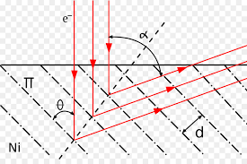
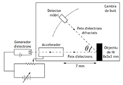
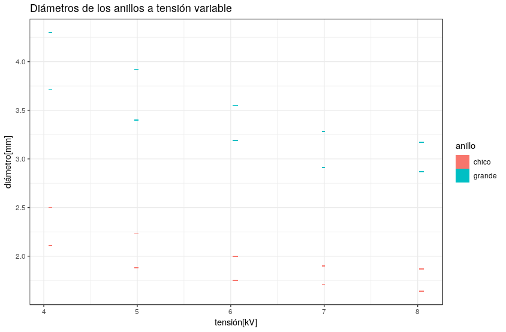
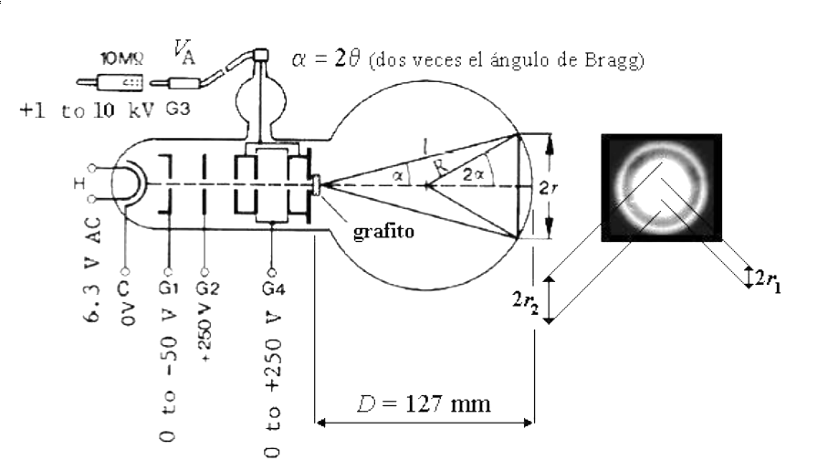
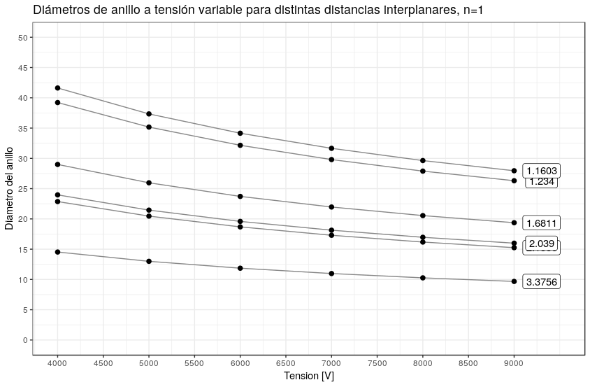
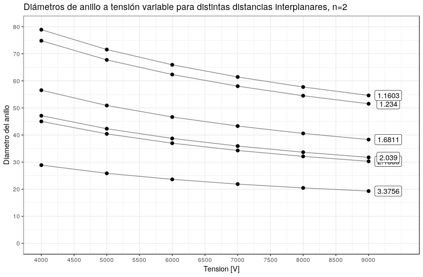

## Introduccion

La primera persona en proponer que la materia tiene comportamiento tanto ondulatorio como corpuscular fue L de Broglie, en 1924. Sin embargo en esa época no le fue posible conseguir evidencia que apoye su teoría. Así como se sabía que la luz tiene propiedades ondulatorias y corpusculares el conjeturo que quizá la materia también se comportaria similarmente.

Los primeros en observar el fenómeno de difracción  fueron Davisson y Germer en los laboratorios de Bell Telephone. Ellos se encontraban estudiando la dispersión de un haz de electrones contra un blanco de níquel. Luego de un largo periodo de bombardeo de electrones notaron sobre la placa receptora máximos y mínimos de intensidad, en función del ángulo y la tensión de aceleración.

longitudes de onda de manera trigonométrica, conociendo la tensión de aceleración, la distancia interplanar del cristal y el diámetro de proyección.

$$\mathrm{F}= \frac{E}{h}$$

$$\mathrm{\lambda}= \frac{H}{p}$$ 

Donde E y p son la energía y cantidad de movimiento del electrón respectivamente y h la constante de Planck.

De esta manera demostraron que las partículas de materia presentan características de ondas en determinadas condiciones, confirmando así la hipótesis de De Broglie sobre la dualidad onda-partícula.

## Metodo experimental
Dispositivo:
IMG 3

Para llevar a cabo la experiencia se utilizó un bulbo en el cual electrones acelerados mediante un potencial chocan contra un policristal de grafito y son difractados con cierto ángulo.

Cada uno de los potenciales que se ven en la figura cumple una función. G1 es un potencial de frenado que detiene a los electrones más débiles. G2 y G4 enfocan y coliman el haz de electrones y G3 se encarga de acelerarlos.

El fenómeno de difracción se manifiesta en el bulbo mediante anillos que varían su radio dependiendo del potencial que acelera los electrones.

Las herramientas utilizadas en la experiencia fueron un multímetro para medir el potencial de aceleración y un vernier para medir el diámetro de los anillos de difracción.

Para lograr mayor precisión se midió el diámetro exterior e interior de cada anillo y luego se calculó su promedio.

### Instrumentos utilizados
-   Fuente de alta tensión
-   Tubo de difracción de electrones
-   Pantalla de fósforo
-   Cables conductores
-   Resistencias (10M )
-   Fuente VDC
-   Calibre
-   Divisor de tensión para lectura del altimetría
-   Altímetro

### Procedimiento de medición
1.  Se arma el banco de medición con los dispositivos ya nombrados como se ve en la figura. Además se usa un divisor de tensión para obtener una lectura más precisa.
2.  Se va variando la tensión de la fuente y se fija.
3.  Se miden los diámetros internos y externos de los anillos de Debye-Scherrer con un calibre. Se miden solo los anillos más intensos que se observan (para todo V).
4.  Se repiten los pasos (2) y (3) hasta los 9kV.

IMG4

Como se ve en la figura, sobre la pantalla de fósforo se observan anillos concéntricos denominados anillos de Debye-Scherrer. Este patrón de interferencia se produce como ya se mencionó por la estructura del material utilizado como red espacial de difracción, que al tener variedad de planos con disposiciones angulares diferentes, hacen que aparezcan circunferencias en la pantalla perpendicular a la dirección de incidencia. En cuanto a la manera de medir los anillos, decidimos medir su diámetro, disminuyendo el error que se cometería queriendo ubicar el eje central de los círculos

Al tener todas las mediciones de los anillos, podemos calcular los ángulos de Bragg para tales. Viendo la figura, se ve claramente que se puede determinar con la siguiente relación trigonométrica

EQ3
Demostración de la fórmula en apéndice.

siendo:
-   el ángulo de Bragg
-   d el diámetro del anillo
-   D el diámetro del bulbo

## Resultados y análisis

En la siguiente tabla podemos ver los resultados obtenidos en las mediciones. En
tipo de anillo, G significa anillo grande y C anillo chico.

### Resultados obtenidos
En la siguiente tabla podemos ver los resultados obtenidos en las mediciones. En la columna "Anillo", G significa anillo grande y C anillo chico.

| $T$     | $\Delta T$ |  $d_{int}$ |  $d_{ext}$ |  Anillo|
|---------|------------|-------|-------|-------|
| 4.07    |  0.04      |  3.71 |  4.30 |  G    |
| 4.07    |  0.04      |  2.11 |  2.50 |  C    |
| 4.99    |  0.04      |  3.40 |  3.92 |  G    |
| 4.99    |  0.04      |  1.88 |  2.23 |  C    |
| 6.05    |  0.06      |  3.19 |  3.55 |  G    |
| 6.05    |  0.06      |  1.75 |  2.00 |  C    |
| 6.99    |  0.06      |  2.91 |  3.28 |  G    |
| 6.99    |  0.06      |  1.71 |  1.90 |  C    |
| 8.04    |  0.06      |  2.87 |  3.17 |  G    |
| 8.04    |  0.06      |  1.64 |  1.87 |  C    |

### Análisis de los resultados

   

## Conclusiones

## Apéndice - cuestionario

### Experimento de Davison-Germer y la Ley de Bragg

### Relación entre longitud de onda y energía cinética  

La ecuación que nos va a permitir relacionar la longitud de onda y la energía
cinética principalmente será la de de Broglie: $\lambda = \frac{h}{p}$,
y dependiendo de las condiciones del problema, podemos usar la ecuación de la
energía cinética de la mecánica clásica o deberemos usar la de la mecánica
relativista.   

En el caso clásico, donde la energía cinética del electrón es relativamente
pequeña respecto a la energía asociada a la masa en reposo, podemos usar la
asociación entre energía cinética y cantidad de movimiento lineal:   

$$\mathrm{E}_c = \frac{p^2}{2m}$$ 

Al reemplazar la cantidad de movimiento $p$ por $\frac{h}{p}$
obtenemos: 

$$ \lambda = \frac{h}{\sqrt{2m\mathrm{E}_c}} $$

En el caso que la aproximación clásica no se pueda utilizar dadas las
condiciones del problema, será necesario usar las ecuaciones de la mecánica
relativista. En este caso tenemos el par de ecuaciones:

$$
\left\{\begin{matrix}
	\mathrm{E} = mc^2 + \mathrm{E}_c + \mathrm{E}_p\\
	\mathrm{E}^2 = (pc)^2 + (mc^2)^2
\end{matrix}\right.
$$

Para este experimento, nos interesa analizar el estado del electrón en el
instante que sale del tubo. Si definimos el potencial eléctrico en ese punto
como el cero de referencia podemos considerar $\mathrm{E}_p = 0$. En el viaje
desde la expulsión desde el electrón hasta el choque contra la pantalla de
fósforo no hay es necesario considerar ningún campo eléctrico o gravitatorio.

Sustituyendo la primera ecuación en la segunda, y aplicando la misma sustitución
de cantidad de movimiento por las variables asociadas a la onda de la materia,
terminamos con la siguiente expresión:

$$\lambda = \frac{hc}{\sqrt{\mathrm{E}_c(\mathrm{E}_c + 2mc^2)}}$$

### Cambio de la longitud de onda de los electrones

Como $\lambda = \frac{h}{p}$ (de los postulados de de Broglie), se debe campiar
el impulso de los electrones para cambiar su onda. Esto lo podemos lograr
controlando la tensión del circuito acelerador.

Si $V_{max} = 10 kV$, entonces $\mathrm{E}_c^{max} = 10 keV$.   

Utilizando la hipótesis no relativista obtenemos:  

$$\lambda_{clasico} = \frac{h}{\sqrt{2m_e 10keV}} = 0,1226 \AA$$   

Utilizando las ecuaciones de la mecánica relativista logramos:

$$\lambda_{relativista} = \frac{hc}{\sqrt{10keV(10keV + 2m_ec^2)}}
= 0,1220 \AA$$  

Lo cual nos da un error porcentual de $e_r \approx 0,5\%$.

### Aparición de anillos en el bulbo

Dado que el policristal que se utiliza en el experimento fue molido, 
la orientación de las estructuras regulares del cristal se vuelve aleatoria, y
esto le termina dando una simetría de revolución a la dispersión de las ondas de
los electrones.

### Ángulo de dispersión

   

### Minimización del error de medición  

El calibre es un instrumento bastante sencillo con un error de apreciación bajo
($e_{ap} = 0.1\mathrm{mm}$). Una opción sería medir directamente el espesor de cada
anillo, pero entonces el error de apreciación será relativamente alto respecto
al mensurando.    

Una manera mejor es medir los radios internos y externos por separado, para
medir de manera indirecta el espesor. Si bien el error absoluto se duplicará
(por propagación lineal, el error de la suma es la suma de los errores),
relativamente a la magnitud que se mide será mucho menor.

### Cálculo del $\theta$ sin aproximación  

En la Figura 3 podemos ver la geometría del dispositivo experimental. Esto nos
permite ver cómo se relaciona el ángulo de dispersión (y en definitiva el ángulo
de Bragg) con las dimensiones del bulbo y de los anillos que se observan en la
pantalla de fósforo.

   

Usando la notación del gráfico, observamos que: 

$$\sin (2\alpha) = \frac{r}{R} \Rightarrow \theta = \frac{1}{4}
\arcsin\left (\frac{r}{R} \right )$$

Y esto nos da un método sin aproximaciones para calcular el ángulo de Bragg, ya
que $r$ es lo que medimos (el radio del anillo) y $R$ es conocido (el radio del
bulbo).

### Tablas de $\theta$ para distintos $n, v, d$  

   
   
