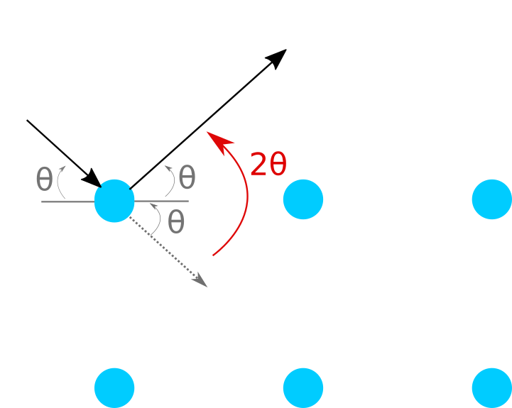

## Cuestionario

### Experimento de Davison-Germer y la Ley de Bragg

### Relación entre longitud de onda y energía cinética  

La ecuación que nos va a permitir relacionar la longitud de onda y la energía
cinética principalmente será la de de Broglie: $\lambda = \frac{h}{p}$,
y dependiendo de las condiciones del problema, podemos usar la ecuación de la
energía cinética de la mecánica clásica o deberemos usar la de la mecánica
relativista.   

En el caso clásico, donde la energía cinética del electrón es relativamente
pequeña respecto a la energía asociada a la masa en reposo, podemos usar la
asociación entre energía cinética y cantidad de movimiento lineal:   

$$\mathrm{E}_c = \frac{p^2}{2m}$$ 

Al reemplazar la cantidad de movimiento $p$ por $\frac{h}{p}$
obtenemos: 

$$ \lambda = \frac{h}{\sqrt{2m\mathrm{E}_c}} $$

En el caso que la aproximación clásica no se pueda utilizar dadas las
condiciones del problema, será necesario usar las ecuaciones de la mecánica
relativista. En este caso tenemos el par de ecuaciones:

$$
\left\{\begin{matrix}
	\mathrm{E} = mc^2 + \mathrm{E}_c + \mathrm{E}_p\\
	\mathrm{E}^2 = (pc)^2 + (mc^2)^2
\end{matrix}\right.
$$

Para este experimento, nos interesa analizar el estado del electrón en el
instante que sale del tubo. Si definimos el potencial eléctrico en ese punto
como el cero de referencia podemos considerar $\mathrm{E}_p = 0$. En el viaje
desde la expulsión desde el electrón hasta el choque contra la pantalla de
fósforo no hay es necesario considerar ningún campo eléctrico o gravitatorio.

Sustituyendo la primera ecuación en la segunda, y aplicando la misma sustitución
de cantidad de movimiento por las variables asociadas a la onda de la materia,
terminamos con la siguiente expresión:

$$\lambda = \frac{hc}{\sqrt{\mathrm{E}_c(\mathrm{E}_c + 2mc^2)}}$$

### Cambio de la longitud de onda de los electrones

Como $\lambda = \frac{h}{p}$ (de los postulados de de Broglie), se debe campiar
el impulso de los electrones para cambiar su onda. Esto lo podemos lograr
controlando la tensión del circuito acelerador.

Si $V_{max} = 10 kV$, entonces $\mathrm{E}_c^{max} = 10 keV$.   

Utilizando la hipótesis no relativista obtenemos:  

$$\lambda_{clasico} = \frac{h}{\sqrt{2m_e 10keV}} = 0,1226 \AA$$   

Utilizando las ecuaciones de la mecánica relativista logramos:

$$\lambda_{relativista} = \frac{hc}{\sqrt{10keV(10keV + 2m_ec^2)}}
= 0,1220 \AA$$  

Lo cual nos da un error porcentual de $e_r \approx 0,5\%$.

### Aparición de anillos en el bulbo

### Ángulo de dispersión

   

### Minimización del error de medición

### Cálculo del $\theta$ sin aproximación

### Tablas de $\theta$ para distintos $n, v, d$
