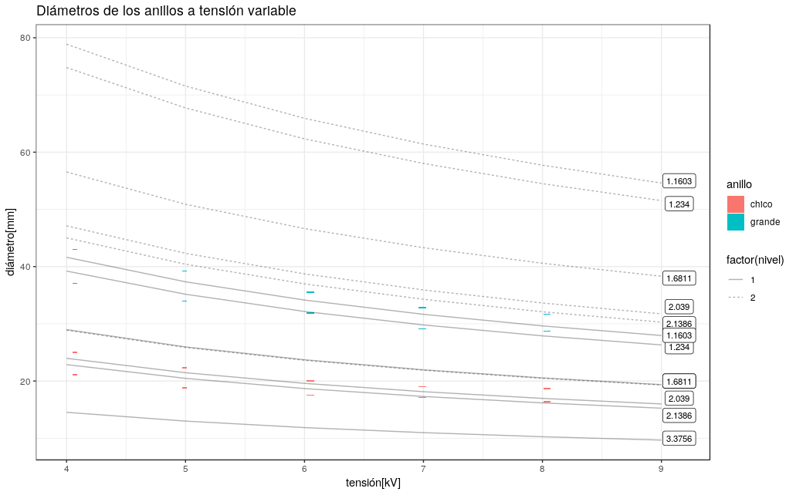

\newpage

## Resumen
El trabajo práctico consiste en hacer pasar un haz de electrones, acelerados por un potencial V, a través de un policristal de grafito y observar el diagrama de interferencia que estos producen sobre una pantalla de fósforo, pudiendo así calcular la distancia interplanar del cristal, y la longitud de onda del haz difractado.

## Introducción

La primera persona en proponer que la materia tiene comportamiento tanto 
ondulatorio como corpuscular fue Louis de Broglie, en 1924. Así como se sabía que 
la luz tiene propiedades ondulatorias y corpusculares, postuló que la materia 
también tendría una dualidad en su comportamiento.

Los primeros en observar el fenómeno de difracción fueron Davisson y Germer en 
los laboratorios de Bell Telephone. Ellos se encontraban estudiando la dispersión
de un haz de electrones contra un blanco de níquel. Luego de un largo periodo 
de bombardeo de electrones notaron sobre la placa receptora máximos y mínimos 
de intensidad, en función del ángulo y la tensión de aceleración.

Al notar este fenómeno lo reprodujeron con diferentes monocristales logrando deducir las longitudes de onda de manera trigonométrica, conociendo la tensión de aceleración, la distancia interplanar del cristal y el diámetro de proyección.

$$f = \frac{E}{h}$$

$$\lambda = \frac{h}{p}$$

Donde E y p son la energía y cantidad de movimiento del electrón respectivamente y h la constante de Planck.

De esta manera encontraron evidencia de un comportamiento de la materia que
no corresponde al modelo de partícula sino a un modelo de onda; es decir,
la materia también presentaba una dualidad onda-partícula en su comportamiento.

\newpage

## Método experimental  

Para llevar a cabo la experiencia se utilizó un bulbo en el cual electrones 
acelerados mediante un potencial atraviesan un policristal de grafito y son 
difractados con cierto ángulo, finalmente chocando contra una placa de fósforo.

Cada uno de los potenciales que se ven en la figura cumple una función. G1 es 
un potencial de frenado que detiene a los electrones más débiles. G2 y G4 
enfocan y coliman el haz de electrones y G3 se encarga de acelerarlos.

El fenómeno de difracción se manifiesta en el bulbo mediante anillos que 
varían su radio dependiendo del potencial que acelera los electrones.

Las herramientas utilizadas en la experiencia fueron un multímetro para medir 
el potencial de aceleración y un calibre para medir el diámetro de los anillos 
de difracción.

### Instrumentos utilizados
-   Fuente de alta tensión
-   Tubo de difracción de electrones
-   Pantalla de fósforo
-   Cables conductores
-   Resistencias (10M )
-   Fuente VDC
-   Calibre
-   Divisor de tensión para lectura del altimetría
-   Altímetro

### Procedimiento de medición
1.  Se arma el banco de medición con los dispositivos ya nombrados como se ve en la figura 3. Además se usa un divisor de tensión para obtener una lectura más precisa.
2.  Se va variando la tensión de la fuente y se fija.
3.  Se miden los diámetros internos y externos de los anillos de Debye-Scherrer con un calibre. Se miden solo los anillos más intensos que se observan (para todo V).
4.  Se repiten los pasos (2) y (3) hasta los 9kV.

Como se ve en la figura, sobre la pantalla de fósforo se observan anillos concéntricos denominados anillos de Debye-Scherrer. Este patrón de interferencia se produce como ya se mencionó por la estructura del material utilizado como red espacial de difracción, que al tener variedad de planos con disposiciones angulares diferentes, hacen que aparezcan circunferencias en la pantalla perpendicular a la dirección de incidencia. En cuanto a la manera de medir los anillos, decidimos medir su diámetro, disminuyendo el error que se cometería queriendo ubicar el eje central de los círculos.

Al tener todas las mediciones de los anillos, podemos calcular los ángulos de Bragg para tales. Viendo la figura, se ve claramente que se puede determinar con la siguiente relación trigonométrica (cuya demostración se puede ver en el apéndice)

$$\theta = \frac{1}{4} \arcsin\left (\frac{r}{R} \right )$$

Siendo $\theta$ el ángulo de Bragg, $r$ el diámetro del anillo y $R$ el 
diámetro del bulbo.

## Resultados y análisis

En la siguiente tabla podemos ver los resultados obtenidos en las mediciones. En
tipo de anillo, G significa anillo grande y C anillo chico.

### Resultados obtenidos
En la siguiente tabla podemos ver los resultados obtenidos en las mediciones. En la columna "Anillo", G significa anillo grande y C anillo chico. Se midió el diámetro de los anillos de difracción G y C nombrando los anillos a partir del centro de simetría mediante un calibre (incerteza de 0,1mm):

| $V[v]$     | $\Delta T[v]$ |  $d_{int}[mm]$ |  $d_{ext}[mm]$ |
|---------|------------|-------|-------|
| 4.07    |  0.03      |  37.1 |  43.0 |
| 4.99    |  0.04      |  34.0 |  39.2 |
| 6.05    |  0.05      |  31.9 |  35.5 |
| 6.99    |  0.06      |  29.1 |  32.8 |
| 8.04    |  0.06      |  28.7 |  31.7 |

Table: diámetros de los anillos 1 y 2 del patrón de difracción para el anillo mas grande.

| $V[v]$     | $\Delta T[v]$ |  $d_{int}[mm]$ |  $d_{ext}[mm]$ |
|---------|------------|-------|-------|
| 4.07    |  0.03      |  21.1 |  25.0 |
| 4.99    |  0.04      |  18.8 |  22.3 |
| 6.05    |  0.05      |  17.5 |  20.0 |
| 6.99    |  0.06      |  17.1 |  19.0 |
| 8.04    |  0.06      |  16.4 |  18.7 |

Table: diámetros de los anillos 1 y 2 del patrón de difracción para el anillo mas chico.

A partir de los resultados de la medición, se prosiguió a realizar los cálculos del ángulo de difracción según lo especificado en el apéndice B, junto con el desarrollo de la propagación de errores.  En la siguiente sección se muestran los resultados de los cálculos. 

### Análisis de los resultados

| $V[v]$  | $\alpha_{int} [grad]$ |  $\alpha_{ext} [grad]$ |
|------------------|-----------------|------------------|
| 4.07 $\pm$ 0.04  | 4.78 $\pm$ 0.27 | 5.68 $\pm$  0.32 |
| 4.99 $\pm$ 0.04  | 4.26 $\pm$ 0.25 | 5.06 $\pm$  0.29 |
| 6.05 $\pm$ 0.06  | 3.96 $\pm$ 0.23 | 4.53 $\pm$  0.26 |
| 6.99 $\pm$ 0.06  | 3.87 $\pm$ 0.23 | 3.96 $\pm$  0.25 |
| 8.04 $\pm$ 0.06  | 3.71 $\pm$ 0.22 | 4.23 $\pm$  0.25 |

Table: ángulo de Bragg para anillo mas grande.

| $V[v]$  | $\alpha_{int} [grad]$ |  $\alpha_{ext} [grad]$ |
|-----------------|-----------------|------------------|
| 4.07 $\pm$ 0.03 | 4.78 $\pm$ 0.27 | 9.90 $\pm$  0.32 |
| 4.99 $\pm$ 0.04 | 4.26 $\pm$ 0.25 | 5.06 $\pm$  0.29 |
| 6.05 $\pm$ 0.05 | 3.96 $\pm$ 0.23 | 4.53 $\pm$  0.26 |
| 6.99 $\pm$ 0.06 | 3.87 $\pm$ 0.23 | 3.96 $\pm$  0.25 |
| 8.04 $\pm$ 0.06 | 3.71 $\pm$ 0.22 | 4.23 $\pm$  0.25 |

Table: ángulo de Bragg para anillo mas chico.

Dado que en la naturaleza el fenómeno se presenta de manera continua, los electrones difractados tienen su ángulo de difracción definido por una distribución de probabilidad y por lo tanto las observaciones que proporcionen el menor error experimental serán las mediciones de los diámetros internos y externos de los anillos. Es por ello que los ángulos se presentan para un sub-índice interno o externo.

Observando la tabla 2, se ve claramente que el ángulo de difracción disminuye con el aumento de la tensión. Es de destacar que para este experimento únicamente se tomó las mediciones de los diámetros de los primeros 2 anillos (empezando desde el centro), dado que la intensidad del siguiente anillo ya era muy baja. Al aumentar la tensión, la intensidad del tercer anillo aumentaba y por supuesto su ángulo de difracción también disminuye. 

También obtuvimos la longitud de onda de los electrones según la tensión aplicada.
 (ver anexo B)

| $V[kv]$ | $\Delta V [kv]$ |  $\lambda [\AA]$ |  $\Delta \lambda [\AA]$ |
|---------|------------|-------|-----------|
| 4.07    |  0.03      |  0.1918585131     |       
| 4.99    |  0.04      |  0.1731942208     |       
| 6.05    |  0.05      |  0.1572106535     |       
| 6.99    |  0.06      |  0.1461916664     |       
| 8.04    |  0.06      |  0.1362422209     |      

Table: longitudes de onda (aplicando corrección relativista)

La energía del electrón es la misma que la del campo eléctrico en la que se encuentra y que va a recorrer, por lo tanto tiene sentido que al incrementar la energía del electrón, disminuye su longitud de onda. Las ondas más energéticas son aquellas de corta longitud de onda y gran frecuencia.

| $V[kv]$ | $\Delta V [kv]$ |  $\lambda_{relativista} [\AA]$ | $\lambda_{clasico} [\AA]$ |   $\Delta \lambda [\AA]$ | $\varepsilon$ % |
|---------|------------|----------------|-----------|----------|------|
| 4.07    |  0.03      |  0.1918585     | 0.1922402 | 0.000382 | 0.20 |
| 4.99    |  0.04      |  0.1731942     | 0.1736165 | 0.000422 | 0.24 |
| 6.05    |  0.05      |  0.1572107     | 0.1576753 | 0.000465 | 0.30 |
| 6.99    |  0.06      |  0.1461917     | 0.1466907 | 0.000499 | 0.34 |
| 8.04    |  0.06      |  0.1362422     | 0.1367771 | 0.000535 | 0.39 |
Table: longitudes de onda y sus errores calculados para cada tensión.

Y lógicamente, a medida que los electrones van ganando energía cinética el error relativo por no usar la corrección relativista se hace más relevante.

Luego, determinamos qué familias de planos contribuyen a la formación de los anillos observados, usando la simulación del punto h del cuestionario. 
Para facilitar el análisis de los datos, graficamos los anillos calculados y los medidos en función de las distintas tensiones aplicadas.

El primer anillo (empezando desde el centro) corresponde a la distancia interplanar del cristal con distancia de $2,1386 \AA$.

| $Diametro[mm]$ | $d=2.1386 \AA, n=1$ | $\varepsilon$ % |
|-----------------|------------|-------|
| 21.1 $\pm$ 0.1  |  22.8      |   7.5 |
| 18.8 $\pm$ 0.1  |  20.4      |   7.8 |
| 17.5 $\pm$ 0.1  |  18.6      |   5.9 |
| 17.1 $\pm$ 0.1  |  17.3      |   1.1 |
| 16.4 $\pm$ 0.1  |  16.2      |   1.2 |

Table:  comparación de diámetros internos obtenidos experimentalmente con diámetro para n=1 y distancia interplanar 2,1386 Å

El segundo anillo corresponde a la distancia  $1,2340 \AA$.

| $Diametro[mm]$ | $d=1.2340 \AA, n=1$ | $\varepsilon$ % |
|-----------------|------------|-------|
| 37.1 $\pm$ 0.1  |  39.2      |   5.3 |
| 34.0 $\pm$ 0.1  |  35.2      |   3.4 |
| 31.9 $\pm$ 0.1  |  32.2      |   0.9 |
| 29.1 $\pm$ 0.1  |  29.8      |   2.3 |
| 28.7 $\pm$ 0.1  |  27.9      |   2.7 |

Table:  comparación de diámetros externos obtenidos experimentalmente con diámetro para n=1 y distancia interplanar 1,2340 \AA

En la figura 4 superponemos los resultados experimentales y los valores de
los diámetros en función de la tensión para algunas distancias interplanares
conocidas.  
A partir del gráfico de los resultados podemos ver que los anillos medidos
(que, a diferencia de las líneas que representan los anillos teóricos 
calculados antes, *sí* tienen espesor) encierran en su parte brillante a más
de una curva de distancia interplanar.

En el caso del anillo grande, vemos que se encierra al anillo de orden de difracción $1$ del
plano con $d = 1.16\AA$ y del mismo orden de difracción $d = 1.2340\AA$. En el chico, vemos
que los anillos encerrados son $d = 2.0390\AA$ y $d = 2.1386$ del orden de difracción $1$.  

Postulamos, entonces, que no sólo una distancia interplanar contribuye al 
patrón de interferencia que observamos con los anillos, sino que son múltiples.

Estas observaciones se cumplen para todas las mediciones excepto la de 
$\mathrm{Tension} = (8.04 \pm 0.06)kV$, en la que en ambos anillos sólo queda
una distancia interplanar adentro. En ambos casos hay un aumento del valor que
logra esto. Esto puede ser una sobre-estimación del valor, y puede deberse
a un error bajo en la medición del diámetro. Para definirlo, sólo tomamos el 
error de apreciación del instrumento ($e_{ap} = 0.1mm$), pero las condiciones
de medición aumentan el error: el hecho de que se mida el punto en el que la luz
deja de ser brillante y que no sea una línea tan definida, la medición en la 
oscuridad, la curvatura del bulbo. 

Teniendo en cuenta estos factores que aumentan el error, podríamos tomar
el hecho de que en la última medición se descarte una distancia interplanar 
en cada anillo es debdio a una sub-estimación del error. Esto cobra especial
importancia en el caso del anillo chico, donde se ve que la diferencia es
mínima.

## Conclusiones

Los resultados obtenidos satisfacen la hipótesis de que la materia corpuscular también presenta cualidades ondulatorias. Las longitudes de onda para los electrones coinciden con lo calculado teóricamente en función de las tensiones medidas. El máximo error relativo fue del 7.8%, un número bajo que inspira confianza sobre los resultados que prueban el modelo de De Broglie.
Los diámetros hallados experimentalmente, se ajustan a los diámetros calculados analiticamente expresados en el gráfico como [1.2340E-10 m, n=1] y [2.1386E-10 m, n=1] los cuales corresponden a las  las distancias interplanares 1,2340 Å y 2,1386 Å respectivamente, tal como se había hallado previamente en las tablas 5 y 6.
A su vez, por medio del gráfico pudimos observar que los diámetros de anillos correspondientes a la distancia interplanar [2.1386E-10 m, n=1] y [2.0390E-10 m, n=1] quedan dentro del área dada entre los diámetros d1int y d1ext. Y lo mismo es observado para [1.2340E-10 m, n=1] y [1.1603E-10 m, n=1], los cuales quedan entre los diametros d2int y d2ext. La razón de que ocurra éste fenómeno podría ser que mas de una distancia interplanar esté contribuyendo a la formación de los anillos (en este caso son 2 distancias interplanares distintas para cada anillo, d1 y d2).  

## Apéndice A - cuestionario

### Experimento de Davison-Germer y la Ley de Bragg

El experimento de Davisson y Germer demostró que los objetos corpusculares presentaban un carácter ondulatorio, corroborando la hipótesis de Louis-Victor de Broglie, en la que expone que toda la materia, (electrones, átomos o moléculas), presenta características tanto corpusculares como ondulatorias.

En este experimento, un monocristal es bombardeado con electrones acelerados por un potencial eléctrico V. Suponiendo que  los electrones presentan un comportamiento ondulatorio, la onda incidente se refleja en cada uno de los planos atómicos, existiendo una interferencia constructiva de las ondas reflejadas en planos paralelos consecutivos descritos por la Ley de Bragg.

Lo que se observa es que estos son reflejados mayoritariamente en aquellas direcciones privilegiadas para las que exista interferencia constructiva, lo cual demuestra la hipótesis de de broglie.

Cuando los rayos X alcanzan un átomo interactúan con sus electrones exteriores. Estos reemiten la radiación electromagnética incidente en diferentes direcciones y con la misma frecuencia (en realidad debido a varios efectos hay pequeños cambios en su frecuencia). Este fenómeno se conoce como dispersión de Rayleigh (o dispersión elástica). Los rayos X reemitidos desde átomos cercanos interfieren entre sí constructiva o destructivamente. Este es el fenómeno de la difracción.

La radiación incidente llega a átomos consecutivos con un ligero desfase (izquierda). La radiación dispersada por los átomos (círculos azules) interfiere con radiación dispersada por átomos adyacentes. Las direcciones en las que los círculos se superponen son direcciones de interferencia constructiva.

La interferencia es constructiva cuando la diferencia de fase entre la radiación emitida por diferentes átomos es proporcional a 2 pi. Esta condición se expresa en la ley de Bragg:

$$\ n \lambda = 2 d \sin(\theta)$$

### Relación entre longitud de onda y energía cinética  

La ecuación que nos va a permitir relacionar la longitud de onda y la energía
cinética principalmente será la de de Broglie: $\lambda = \frac{h}{p}$,
y dependiendo de las condiciones del problema, podemos usar la ecuación de la
energía cinética de la mecánica clásica o deberemos usar la de la mecánica
relativista.   

En el caso clásico, donde la energía cinética del electrón es relativamente
pequeña respecto a la energía asociada a la masa en reposo, podemos usar la
asociación entre energía cinética y cantidad de movimiento lineal:   

$$\ n \lambda = \frac{h}{\sqrt{2m_e 10keV}} = 0,1226 \AA$$

$$\mathrm{E}_c = \frac{p^2}{2m}$$ 

Al reemplazar la cantidad de movimiento $p$ por $\frac{h}{p}$
obtenemos: 

$$ \lambda = \frac{h}{\sqrt{2m\mathrm{E}_c}} $$

En el caso que la aproximación clásica no se pueda utilizar dadas las
condiciones del problema, será necesario usar las ecuaciones de la mecánica
relativista. En este caso tenemos el par de ecuaciones:

$$
\left\{\begin{matrix}
	\mathrm{E} = mc^2 + \mathrm{E}_c + \mathrm{E}_p\\
	\mathrm{E}^2 = (pc)^2 + (mc^2)^2
\end{matrix}\right.
$$

Para este experimento, nos interesa analizar el estado del electrón en el
instante que sale del tubo. Si definimos el potencial eléctrico en ese punto
como el cero de referencia podemos considerar $\mathrm{E}_p = 0$. En el viaje
desde la expulsión desde el electrón hasta el choque contra la pantalla de
fósforo no hay es necesario considerar ningún campo eléctrico o gravitatorio.

Sustituyendo la primera ecuación en la segunda, y aplicando la misma sustitución
de cantidad de movimiento por las variables asociadas a la onda de la materia,
terminamos con la siguiente expresión:

$$\lambda = \frac{hc}{\sqrt{\mathrm{E}_c(\mathrm{E}_c + 2mc^2)}}$$

### Cambio de la longitud de onda de los electrones

Como $\lambda = \frac{h}{p}$ (de los postulados de de Broglie), se debe campiar
el impulso de los electrones para cambiar su onda. Esto lo podemos lograr
controlando la tensión del circuito acelerador.

Si $V_{max} = 10 kV$, entonces $\mathrm{E}_c^{max} = 10 keV$.   

Utilizando la hipótesis no relativista obtenemos:  

$$\lambda_{clasico} = \frac{h}{\sqrt{2m_e 10keV}} = 0,1226 \AA$$   

Utilizando las ecuaciones de la mecánica relativista logramos:

$$\lambda_{relativista} = \frac{hc}{\sqrt{10keV(10keV + 2m_ec^2)}}
= 0,1220 \AA$$  

Lo cual nos da un error porcentual de $e_r \approx 0,5\%$.

### Aparición de anillos en el bulbo

Dado que el policristal que se utiliza en el experimento fue molido, 
la orientación de las estructuras regulares del cristal se vuelve aleatoria, y
esto le termina dando una simetría de revolución a la dispersión de las ondas de
los electrones.

### Ángulo de dispersión

   

### Minimización del error de medición  

El calibre es un instrumento bastante sencillo con un error de apreciación bajo
($e_{ap} = 0.1\mathrm{mm}$). Una opción sería medir directamente el espesor de cada
anillo, pero entonces el error de apreciación será relativamente alto respecto
al mensurando.    

Una manera mejor es medir los radios internos y externos por separado, para
medir de manera indirecta el espesor. Si bien el error absoluto se duplicará
(por propagación lineal, el error de la suma es la suma de los errores),
relativamente a la magnitud que se mide será mucho menor.

### Cálculo del $\theta$ sin aproximación  

En la Figura 3 podemos ver la geometría del dispositivo experimental. Esto nos
permite ver cómo se relaciona el ángulo de dispersión (y en definitiva el ángulo
de Bragg) con las dimensiones del bulbo y de los anillos que se observan en la
pantalla de fósforo.

   

Usando la notación del gráfico, observamos que: 

$$\sin (2\alpha) = \frac{r}{R} \Rightarrow \theta = \frac{1}{4}
\arcsin\left (\frac{r}{R} \right )$$

Y esto nos da un método sin aproximaciones para calcular el ángulo de Bragg, ya
que $r$ es lo que medimos (el radio del anillo) y $R$ es conocido (el radio del
bulbo).

### Tablas de $\theta$ para distintos $n, v, d$  

   
   

## Apéndice B 

Utilizando los postulados de De Broglie y la hipótesis no relativista 
(que en el apéndice se ve que tiene un error menor al $1\%$ en este orden
de energías) podemos calcular las longitudes de onda de las funciones de onda
asociadas a los electrones, con la siguiente relación:
$$\lambda = \frac{h}{\sqrt{2m_e E_c}}$$
donde $h$ es la constante de Planck, $m_e$ la masa del electrón y $E_c$ la energia
cinetica del electron a causa de la tensión con la cual se acelera a los electrones.

Para calcular $\Delta \lambda$ utilizamos propagación lineal de variables.
Dado que las energias de los electrones estan en el orden de los KeV, lo cual es mucho menor a $m_o c^2$, podemos usar la siguiente expresión para el calculo de la incerteza:

$$\Delta \lambda(T, \Delta T) =
\left |
	\frac{\partial}{\partial T} \left (
		\frac{h}{\sqrt{2m_e T}}
	\right )(T) \times \Delta T
\right | = \frac{h}{\sqrt{2m_e}\ T^{3/2}} \Delta T$$

